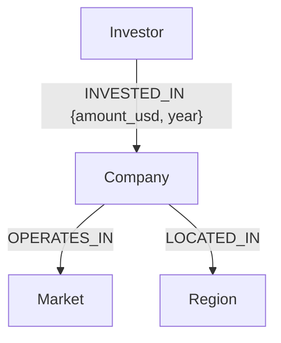

# Tech & Startup Ecosystem GraphRAG

## Use Case & Why a Graph Database?
This application is a **Knowledge Graph Powered Research Assistant** that allows users to ask natural language questions about the technology and startup ecosystem (e.g., Crunchbase data).

**Why a Graph Database?**
A relational schema is inherently rigid and requires predefined JOINs for every path you wish to query. In a startup ecosystem, you often want to query arbitrary, multi-hop semantic relationships (e.g., "Find all companies operating in the AI market that were funded by investors who previously invested in companies located in San Francisco"). 

A Graph Database (CognoDB/Neo4j) makes relationships first-class citizens. This allows for lightning-fast, multi-hop traversals and flexible schema evolution, making it the perfect foundation for a Retrieval-Augmented Generation (GraphRAG) AI application.

## Data Model



## Setup Instructions

### 1. Credentials
Create a `.env` file in the `backend/` directory:
```env
COGNODB_URI="bolt+s://<your-instance>.databases.cognodb.cloud"
COGNODB_PASSWORD="<your-password>"
GEMINI_API_KEY="<your-gemini-key>"
```

### 2. Data Population & Seeding
This application comes with an automatic seeder. You have two options for data population:
**Option A: Real Dataset (Recommended)**
1. Download the [Startup Investments Dataset from Kaggle](https://www.kaggle.com/datasets/arindam235/startup-investments-crunchbase).
2. Extract the downloaded archive and place the `investments_VC.csv` file into the `backend/data/` directory.
3. The seed script will automatically detect it and parse the real investment data into the graph.

**Option B: Synthetic Data**
If you do not provide the CSV file, the seed script will automatically fall back to generating synthetic Tech Startup data so you can test the application immediately!

**Run the Seeder:**
Ensure your `.env` is set up, then run the python script from the project root:
```bash
python backend/app/seed_data.py
```

### 3. Run with Docker Compose
```bash
docker-compose up --build
```
This will start the FastAPI backend on port 8000.

### 4. Run Frontend
In a separate terminal:
```bash
cd frontend
npm install
npm run dev
```

## Main Cypher Queries Explained
The core query strategy uses Gemini LLM to dynamically generate Cypher based on the schema. A common multi-hop traversal generated looks like:
```cypher
MATCH (i:Investor)-[r:INVESTED_IN]->(c:Company)-[:OPERATES_IN]->(m:Market)
WHERE m.name = 'Artificial Intelligence'
RETURN i, r, c, m
LIMIT 50
```
This single query traverses three nodes and two relationships, retrieving the entire semantic context needed by the LLM to formulate an answer, which would require multiple expensive JOINs in SQL.
